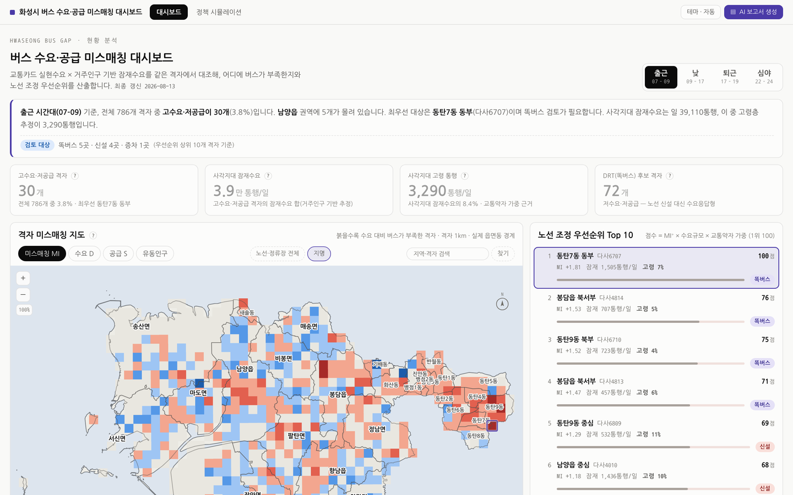
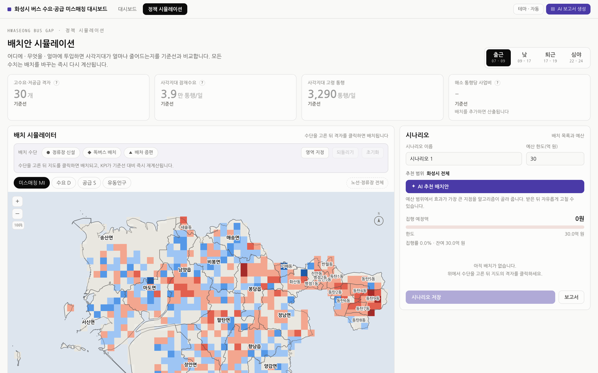

# 화성시 버스 수요·공급 미스매칭 대시보드 — 프론트엔드

> 26년 여름학기 AI화성챌린지 대학생 솔루션데이 · 과제 23번(교통분야)
> 백엔드: [hwaseong-dashboard-backend](https://github.com/2026-AIHwaseong-project/hwaseong-dashboard-backend)

교통카드 실현수요와 거주인구 기반 잠재수요를 같은 1km 격자에서 대조해
**대중교통 사각지대**를 찾아내고, **노선 조정 우선순위**와 **정책 시뮬레이션**을
한 화면에서 제공하는 웹 대시보드입니다.





---

## 한눈에

**무엇이 문제인가.** 버스가 부족한 곳을 승하차 실적만으로 찾으면 틀립니다.
버스가 없어서 아예 발생하지 못한 통행은 카드에 찍히지 않기 때문입니다.
실적이 낮은 곳이 "수요가 없는 곳"인지 "버스가 없어서 못 타는 곳"인지 구분되지 않습니다.

**어떻게 푸는가.** 실현수요(교통카드)와 잠재수요(거주인구)를 절반씩 섞어 수요 D 를 만들고,
운행빈도와 정류장 접근성으로 공급 S 를 만들어, 같은 격자에서 **표준화 차이(MI)** 를 봅니다.
그리고 그 격차를 실제로 줄이려면 어디에 무엇을 얼마에 넣어야 하는지 시뮬레이션합니다.

**추천 위치는 언어모델이 아니라 최적화 알고리즘이 정합니다.**
LLM 에 맡기면 매번 답이 달라지고 근거를 댈 수 없습니다.
AI 는 선정된 결과를 문장으로 다듬는 일만 맡습니다.

> 심사에서 "AI가 어떻게 위치를 정했나요?" 라고 물으면
> **"예산 제약 하 한계효과 최대화 알고리즘으로 선정하고, 선정 근거를 AI가 문서화합니다"**
> 라고 답하시면 됩니다.

산출 예시 — 출근(07–09) 시간대, 2026-08-13 산출 기준:

| 지표 | 값 |
|---|---|
| 분석 격자 | 786개 (1km) |
| 고수요·저공급 격자 | 30개 (3.8%) · 최우선 동탄7동 동부 |
| 사각지대 잠재수요 | 39,110 통행/일 |
| 그중 고령층 추정 | 3,290 통행/일 (8.4%) |
| 똑버스(DRT) 후보 격자 | 72개 |

---

# 심사·발표용

## 1. 무엇을 하는가

| 화면 | 파일 | 하는 일 |
|---|---|---|
| **분석 대시보드** | `index.html` | 어디가 부족한지 찾고 우선순위를 매깁니다 |
| **정책 시뮬레이션** | `simulation.html` | 무엇을 얼마에 넣으면 얼마나 해소되는지 비교합니다 |
| **AI 보고서** | 두 화면 상단 버튼 | 현재 분석·시나리오를 근거로 검토 보고서 초안을 만들어 **한글(.rtf)·엑셀(.xlsx)** 로 저장합니다 |

**분석 대시보드** — 격자 미스매칭 지도 · 이 격자를 지나는 노선 · 노선 조정 우선순위 Top 10 ·
수요–공급 4분면 · 정류장 시간대 프로파일 · 권역별 요약

**정류장 시간대 프로파일이 있어야 하는 이유** — 격자 단위 분석만 있으면 "그래서 실제
정류장은 어떤데?"에 답을 못 합니다. 격자를 클릭하면 최근접 정류장 프로파일로 자동
전환되므로 거시(격자) ↔ 미시(정류장)를 오갈 수 있습니다.

**정책 시뮬레이션** — 배치 시뮬레이터(수단을 고르고 격자를 클릭해 배치, 영역 지정 가능) ·
시나리오(저장·불러오기·AI 추천 배치안) · 시간대별 사각지대 격자 기준선 대비 ·
수단별 소요액 · 정책 판단 요약

지도는 SVG 로 직접 그리고 그 뒤에 카카오맵 배경을 한 겹 깝니다.
확대하면 건물·지명이 드러나 "이 격자 안에 실제로 무엇이 있는지" 확인할 수 있습니다.

## 2. 산출 로직

수치는 전부 백엔드가 산출하고 화면은 표시만 합니다. 아래는 백엔드 실코드 기준이며,
**정본은 [백엔드 README §2](https://github.com/2026-AIHwaseong-project/hwaseong-dashboard-backend#2-산출-로직)** 입니다
(감쇠항·절대 가드 등 배경 설명이 그쪽에 있습니다).

```
D  수요지수    = 0.5 · 정규화(승차) + 0.5 · 정규화(잠재수요)
     승차      = 교통카드 초승(환승 제외) · 평일 일평균
     잠재수요  = Σ(격자의 연령대별 거주인구 × 그 연령대의 시간대 체류비율)
                 체류비율은 유동인구에서 구합니다 — 격자마다 연령 구성이 달라 값이 다릅니다

S  공급지수    = 0.78 · 정규화(운행빈도) + 0.22 · 정류장 커버리지
     커버리지  = clip(1 − 최근접 정류장 거리 / 600m, 0.05, 1)

MI 미스매칭    = clip( (z(D) − z(S)) × clip(D / dRef, 0, 1)^0.65 , −2.6, +2.6 )
     dRef      = D 의 55분위

우선순위       = MI × (0.35 + 인구가중) × (1 + 1.6 · 고령인구비)
                 단 사각지대(need) 격자에만 부여하고 나머지는 0
     need      = z(D) ≥ 0.20 이고 MI ≥ 0.75

추천 배치안    = 총사업비 1원당 예상 승차 증가량(ΔB̂)이 큰 순으로
                 예산 한도까지 그리디 선택
     ΔB̂       = 포아송 회귀로 추정한 4개 시간대 합산 승차 증가량
```

화면에 "잠재수요 3.9만 통행/일" 처럼 **통행량**으로 나오는 값은 위 잠재수요와 다릅니다 —
그건 격자 인구에 `0.25`(= 전수단 통행 원단위 2.5 × 버스 분담률 0.10, 둘 다 가정계수)를
곱해 KPI 로 환산한 것이고, D 에 들어가는 항이 아닙니다.

**감쇠항 `(D/dRef)^0.65` 가 왜 붙는가.** 없으면 사람이 살지 않는 임야가
"공급 0" 이라는 이유만으로 최우선 사각지대로 올라옵니다. 수요가 기준점보다
낮은 격자는 격차를 그만큼 깎아, 실제로 사람이 있는 곳이 위로 오게 합니다.
클램프(±2.6)는 극단값 하나가 색 스케일 전체를 눌러버리는 것을 막습니다.

우선순위의 `0.35` 오프셋은 인구가중이 0~1 로 정규화돼 있어서 필요합니다.
없으면 인구 하위 격자의 점수가 0 으로 눌려 순위가 인구수만 따라갑니다.
화면의 Top 10 점수는 1위가 100 이 되도록 다시 스케일한 값입니다.

### 수단은 겹치지 않게 정합니다

이 구분이 없으면 가장 싼 정류장이 아무 데나 선택됩니다.
지도의 수단 배지와 추천 결과가 같은 기준을 씁니다.

| 정류장 커버리지 | 진단 | 수단 | 단가 |
|---|---|---|---|
| ≥ 0.50 (정류장 300m 이내) | 정류장은 도보권 안, 버스가 뜸함 | 배차 증편 | 9,500만 원/년 |
| 0.15 ~ 0.50 (300~510m) | 노선은 인근인데 정류장이 멀다 | 정류장 신설 | 4,200만 원 |
| < 0.15 (510m 초과) | 노선망 자체가 닿지 않음 | 똑버스(DRT) | 1.8억 원/년 |

**비용 단위 주의** — 정류장 4,200만 원은 **1회성 시설비**(내용연수 10년, 연환산 420만 원)이고,
똑버스 1.8억 원과 배차 증편 9,500만 원은 **연간 운영비**입니다.
추천의 비교는 **총사업비 기준**입니다 — 예산 한도를 총액으로 자르므로 순위도 같은 자로
매겨야 하기 때문입니다. 다만 똑버스·증편은 이듬해에도 같은 예산이 듭니다.
기본 예산 한도는 30억 원입니다.

#### 단가 근거 (2026-08-14 공개자료 대조)

처음에는 셋 다 시연용 가정값이었는데, 공식 자료를 찾아 맞춰 보니 둘이 실측과 10% 안쪽으로
들어왔습니다. 확인된 것과 아닌 것을 구분해 둡니다.

| 수단 | 우리 단가 | 대조 근거 | 차이 |
|---|---|---|---|
| 똑버스 | 1.8억 원/년 | 경기교통공사 표준운송원가 — 경기도 '23년 526,301원/일·대(연 1억 9,210만), 수원시 '24년 560,428원(연 2억 456만) | **6~12% 낮음(보수적)** |
| 배차 증편 | 9,500만 원/년 | 화성시 마을버스 345대 연간 운송원가 322억 원 → 대당 연 9,333만 원 | **1.8%** |
| 정류장 신설 | 4,200만 원 | 정보안내기(BIT)만 공개단가 확인 — 독립형 1,600만·알뜰형 500만(서울시 '16). 승차대 구조물 단가는 미확인 | 미확정 |

- **증편의 전제** — '1일 4회 증편'을 차량 1대 추가 투입에 준하는 것으로 봅니다. 첨두시간대
  증편은 그 시간에 차량·기사가 따로 붙어야 해서입니다. 기존 차량의 배차 간격만 조이는
  경우라면 과대 추정입니다.
- **똑버스가 보수적인 이유** — 표준운송원가에는 차량 감가상각비가 들어 있는데 우리 단가는
  차량 구매비를 뺐다고 적고 있어, 그만큼 좁게 잡은 셈입니다.
- **정류장을 확정하지 않은 이유** — 승차대 구조물 단가는 지자체 설계내역서 안에만 있어
  공개자료로 확인하지 못했습니다. 참고로 부대공사비를 뺀 스마트쉼터가 성동구 기준
  소형 6,500만·중형 1억 원('24)이라, 4,200만 원은 그 아래에 놓이는 범위입니다.
  확실히 하려면 나라장터 낙찰정보에서 "버스승강장" 낙찰 사례를 조회해야 합니다.

정류장이 미확정이므로 화면·보고서의 "가정값" 표시는 **유지**됩니다 — 다만 이제 무엇이
미확정인지까지 짚어 "가정값 정류장 단가 미확정" 으로 나옵니다.

### 설계상 짚어 둘 점

- **실현수요는 공급에 눌립니다.** 버스가 없어서 발생하지 못한 통행이 있으므로,
  교통카드 승차만 보면 사각지대를 과소평가하게 됩니다. 그래서 거주인구
  기반 잠재수요를 절반의 가중치로 함께 봅니다.
- **정규화 기준은 배치 없는 상태에서 한 번만 잡고 고정합니다.** 매번 다시 잡으면
  시뮬레이션 전후 KPI를 서로 다른 자로 재는 셈이 되어 비교가 무의미해집니다.

## 3. 사용 데이터

| 데이터 | 출처 | 기준 시점 | 쓰임 |
|---|---|---|---|
| 정류소별 승하차 | 경기데이터드림 정류소별 승하차 인원 집계 | 2025-12 ~ 2026-03 | 실현수요(초승·평일), 정류장 프로파일 |
| 교통카드 OD | 교통카드 빅데이터(STCIS) 15분단위 OD | 2026-06-01 | 승차량의 **시간대 배분**(법정동별 곡선) |
| 유동인구 | 경기도 빅데이터 분석갤러리 (화성시) | 2023-12 ~ 2024-01 | 수요지수 D 의 절반, 잠재수요 시간배분 |
| 노선·배차 | 경기도 버스노선 조회 API (GBIS 계열) | — | 공급(운행빈도) |
| 정류소 마스터·경유정류소 | TAGO 버스노선/정류소정보 | — | 노선↔정류장 연결(ARS번호 다리) |
| 정류장 좌표 | 국토교통부 전국 버스정류장 위치정보 | 2025-10-31 | 정류장 위치, 커버리지 |
| 격자 인구 | 통계지리정보서비스(SGIS) 1km 격자 | — | 잠재수요, 고령인구비 |
| 읍면동 경계 | SGIS 읍면동 경계 (bnd_dong_00_2025_2Q) | 2025 2Q | 지도, 권역별 집계 |

승하차와 유동인구 사이에 **약 2년 시차**가 있습니다. 그래서 유동인구는 총량이 아니라
시간배율로만 씁니다.

출처·시점의 정본은 [백엔드 README §3](https://github.com/2026-AIHwaseong-project/hwaseong-dashboard-backend#3-데이터와-시간축)이고,
화면에 나오는 수치의 정본은 서버 응답(`/api/v1/meta` 의 `dataQuality`)입니다.

## 4. 한계와 가정

무엇이 실측이고 무엇이 추정인지는 화면 푸터(데이터 품질)와 엑셀 보고서의
"산출식·주석" 시트에 항목별로 표기됩니다. 실측이 아닌 것은 다음 세 가지입니다.

| 항목 | 성격 | 내용 |
|---|---|---|
| 시간대별 승하차 | **추정** | 원자료에 시간대 정보가 없어, 일자별 실측 총량을 교통카드 OD(15분단위) 실측 시간분포로 안분 |
| 잠재수요의 통행량 환산 | **가정계수** | 격자 인구 × 0.25 (= 원단위 2.5 × 버스분담률 0.10) — KPI 표시용 |
| 사업비 단가·내용연수 | **일부 확정** | 똑버스·증편은 공개자료 대조로 확인(위 [단가 근거](#단가-근거-2026-08-14-공개자료-대조)), 정류장 단가와 내용연수는 여전히 가정값 |

교통카드 OD 의 한계 — 상위 25개 동의 전조합(625쌍, 실데이터 479쌍)만 수집했고
정류장 커버리지는 42.6% 입니다. 전수는 188×188=35,344쌍이라 API 일일 한도를 넘습니다.
표본이 없는 동은 시 전체 곡선으로 대체합니다. **총량이 아니라 시간분포 곡선으로만** 씁니다.

남은 정류장 단가가 확정되면 **금액은 백엔드** `meta.cost`(`analysis/05_load.py`)에서 고치고,
**"가정값" 배지는 프론트** `assets/js/config.js` 의 `COST.stop.confirmed` 를 `true` 로
바꿔야 내려갑니다. 서버 응답에는 단가의 가정값 플래그가 없어서
(`meta.assumptions` 에는 `busTripRate`·`minFreqPerHour` 뿐), 배지는 프론트 설정만 보고
켜집니다. 셋 다 `confirmed:true` 가 되면 배지 자체가 사라집니다.
배지 문구는 `confirmed:false` 인 항목 이름을 모아 만들므로 따로 고칠 필요가 없지만,
엑셀 보고서의 '사업비 근거' 문구는 `assets/js/report.js` 에 하드코딩돼 있어 같이 손봐야
합니다(도움말 문구는 `assets/js/core.js` 의 `HELP.assumedCost`).

모델이 실제로 맞는지에 대한 검증(승차 예측 회귀 · 공간 교차검증 · 공개자료 정성 대조)은
[백엔드 README §4](https://github.com/2026-AIHwaseong-project/hwaseong-dashboard-backend#4-검증)에 있습니다.

시뮬레이션·추천 결과는 위 가정에 기반한 정책 검토용 참고 수치이며,
실제 집행 전에는 실측 단가·현장 실사로 재검증이 필요합니다.

---

# 개발자용

## 5. 실행

백엔드가 데이터를 공급합니다. **백엔드를 먼저 켜세요** —
기동 방법은 [백엔드 README §5](https://github.com/2026-AIHwaseong-project/hwaseong-dashboard-backend#5-빠른-실행)에 있습니다.
기본 주소는 `http://localhost:8000` 입니다.

화면을 여는 방법은 셋 중 아무거나 됩니다.

```bash
# a. 백엔드가 프론트를 직접 서빙 (두 리포가 같은 부모 폴더에 있을 때)
#    → http://localhost:8000/app/          같은 원점이라 CORS 가 없습니다

# b. 개발 서버 (프론트 리포에서)
python3 tools/dev-server.py 5500          # → http://localhost:5500/

# c. index.html 을 브라우저로 직접 열기 (file://)
```

`python3 -m http.server` 대신 `tools/dev-server.py` 를 쓰는 이유는 캐시입니다.
전자는 캐시 헤더를 안 보내서 코드를 고쳐도 브라우저가 예전 `.js` 를 계속 씁니다.
후자는 응답마다 `Cache-Control: no-store` 를 붙입니다.

다른 PC·터널(ngrok)의 백엔드에 붙일 때는 **코드를 고치지 말고** 주소 뒤에 `?server=` 를 붙이세요.
`config.js` 의 하드코딩값보다 우선합니다.

```
index.html?server=https://xxxx.ngrok-free.app   # 한 번 열면 브라우저에 기억됩니다
index.html?server=                              # 기억된 주소 초기화
```

## 6. 검증

고치고 나면 이 둘을 돌립니다. 둘 다 **종료 코드 = 문제 수**입니다.

```bash
node tools/check-css.js          # CSS 가 조용히 죽는 실수 3종 + 레이아웃 규칙 8개
node tools/e2e-live.js           # 실서버 왕복 E2E 38건 (기본 http://127.0.0.1:8000)
node tools/e2e-live.js http://127.0.0.1:8768    # 다른 주소를 볼 때
```

- `e2e-live.js` 의 인자는 **백엔드 주소**입니다. 프론트 개발 서버(:5500)를 넣으면 안 됩니다.
  Node 18+ 가 필요합니다(내장 `fetch` 사용).
- `check-css.js` 가 필요한 이유 — CSS 는 파서가 이해 못 하는 것을 조용히 버립니다.
  주석을 닫지 않으면 그 텍스트가 다음 규칙의 선택자에 붙어 **규칙 하나가 통째로 사라집니다.**
  실제로 `.mapcard{grid-column:span 8}` 이 사라져 지도 카드가 8칸에서 1칸으로 쪼그라든 적이
  있는데, 브라우저 콘솔에는 아무것도 안 찍혔습니다.

## 7. 파일 구조

```
├── index.html                분석 화면 (사이트 첫 화면)
├── simulation.html           정책 시뮬레이션 화면
├── assets/
│   ├── css/app.css           ⬅ 디자인 담당: 색·여백·컴포넌트 전부 여기
│   ├── data/
│   │   ├── boundary.js       읍면동 경계 (자동 생성 · 현재 화면은 로드하지 않음, §9 참고)
│   │   └── hwaseong-dong.geojson   같은 내용의 GeoJSON (백엔드 파이프라인 입력)
│   └── js/
│       ├── config.js         ⬅ 서버 주소·카카오 키·단가 등 배포·시연 설정
│       ├── api.js            서버 통신 단일 창구 (모든 fetch 가 여기를 지남) + 응답 어댑터
│       ├── core.js           공용 유틸(포맷·툴팁·테마·좌표투영·SVG 헬퍼)
│       ├── map.js            격자 지도 컴포넌트 (두 화면 공용 · 카카오 배경 정합 포함)
│       ├── report.js         AI 보고서 + .xlsx/.rtf 생성기
│       ├── dashboard.js      분석 화면 로직
│       └── simulation.js     시뮬레이션 화면 로직
├── tools/
│   ├── build-boundary.py     SGIS SHP → boundary.js 생성기
│   ├── dev-server.py         캐시 없는 개발 서버
│   ├── check-css.js          CSS 사고 검사
│   └── e2e-live.js           실서버 왕복 E2E
└── docs/                     §10 문서 색인 참고
```

### 의존성

**빌드 도구도, 패키지 매니저 의존성도 없습니다.** `npm install` 이 필요 없고
소스를 그대로 브라우저가 읽습니다. 차트는 SVG 를 직접 생성하고, 엑셀은 ZIP 컨테이너를
직접 작성합니다.

한 가지 예외가 있습니다. **지도 배경으로 카카오맵 JS SDK 를 런타임에 CDN
(`dapi.kakao.com`)에서 불러옵니다.** 저장소에 포함되지는 않습니다.
키가 없거나 로드가 실패하거나 5초 안에 타일이 안 오면 **자동으로 SVG 단독 지도로
되돌아갑니다** — 오프라인에서도 지도 기능은 그대로 동작하고 배경 한 겹만 없습니다.
배경이 필요 없으면 `config.js` 의 `KAKAO.enabled` 를 `false` 로 두세요.

검증 스크립트(§6)는 Node 18+ 를 씁니다. 이건 브라우저 런타임과는 무관합니다.

### 지도·차트 라이브러리를 왜 안 쓰나

**초기 계획에는 MapLibre GL JS 전환이 있었습니다. 철회했습니다.** 전환 근거가 셋이었는데
셋 다 사라졌습니다.

| 전환 근거였던 것 | 현재 |
|---|---|
| 격자 3,000개 렌더 성능 | ❌ 소멸 — 격자가 786개로 확정됐고 SVG 로 그대로 그립니다 |
| 실제 행정경계가 필요 | ❌ 소멸 — SGIS 읍면동 실경계 29개를 `meta.map.regions` 로 받아 SVG 에 직접 적용합니다 |
| 배경지도·팬줌 | ❌ 소멸 — 카카오맵 배경을 SVG 뒤에 깔고 확대·이동을 직접 붙였습니다(§9) |

남은 근거가 없는데 npm·Vite·번들러를 새로 들이는 건 손해입니다. **SVG 유지는 폴백이
아니라 기본 선택지입니다.** 차트 라이브러리도 같은 이유로 검토만 하고 넣지 않았습니다.

**React 도 쓰지 않습니다.** 현재 상태 조합(시간대 4 × 레이어 4 × 선택 × 배치 목록)이
모듈 스코프 변수만으로 다 돌아가고 있어 상태관리 라이브러리도 없습니다. 전환을 검토할
조건은 아래 중 **둘 이상**입니다 — 화면을 3개 이상으로 늘릴 계획이다 / 컴포넌트를 다른
과제에서 재사용할 계획이다 / 팀에 React 능숙자가 둘 이상이다. 지금은 셋 다 아닙니다.

### 지원 브라우저

최신 Chrome · Edge · Safari · Firefox. `fetch` · `Promise` · `Element.closest` ·
CSS `:where()` 를 폴백 없이 씁니다. IE11 은 지원하지 않습니다.
소스를 ES5 문법으로 쓰는 것은 구형 브라우저 때문이 아니라 **빌드 단계를 없애기 위해서**입니다.

## 8. 팀 역할별 안내

### 🎨 프론트엔드 · 디자인 담당

**`assets/css/app.css` 만 보면 됩니다.**

- 파일 맨 위 `:root` 에 모든 색·그림자가 CSS 변수로 정의돼 있습니다.
  변수 값만 바꾸면 두 화면 전체 톤이 한 번에 바뀝니다.
- 라이트/다크 각각 별도로 정의돼 있습니다(자동 반전이 아니라 각각 조정한 값).
  상단 [테마] 버튼으로 `자동 → 라이트 → 다크` 순환 확인 가능.
- 컴포넌트는 번호 매긴 구획으로 나뉘어 있고 목차가 파일 상단에 있습니다.
- 고치고 나면 `node tools/check-css.js` 를 돌리세요(§6).

시각화 색 규칙(지키면 색각 이상·흑백 인쇄에서도 읽힙니다):

| 용도 | 규칙 | 변수 |
|---|---|---|
| 미스매칭 MI | 발산형 — 파랑 ← **무채색** → 빨강 | `--mi0` ~ `--mi6` |
| 수요·유동인구 | 순차형 단일 색상(파랑) | `--sb0` ~ `--sb4` |
| 공급 | 순차형 단일 색상(주황) | `--so0` ~ `--so4` |
| 승차/하차 | 범주형 2색 — 파랑·주황 | `--c-board` / `--c-alight` |
| 전/후 비교 | **색이 아니라 스타일로 구분** (기준선=점선 고스트, 시나리오=채움) | `--ink3` / `--c-board` |
| 좋음/나쁨 | 반드시 부호·라벨과 함께 | `--good` / `--bad` |

### 🔌 백엔드 담당

**연동은 완료 상태입니다.** 두 화면 전부 실서버 데이터로 동작하며 정적 폴백이 없습니다.
응답 스키마의 기준은 백엔드 실서버이고, 서버가 아직 안 주는 파생 필드는
`assets/js/api.js` 의 어댑터가 "빠진 키만" 보충합니다 —
서버가 채워 보내기 시작하면 어댑터는 자동으로 물러납니다.

AI 보고서 생성은 **반드시 백엔드에서** 호출합니다.
프론트엔드에 API 키를 두면 브라우저에서 그대로 노출됩니다.
서버는 Claude · GPT · Gemini 를 지원하며, 프론트는 프로바이더를 지정하지 않고
서버 자동 선택에 맡깁니다.

## 9. 운영 메모

**카카오맵 키.** `config.js` 의 `KAKAO.jsKey` 는 **다른 개인 프로젝트에서 빌려 온 임시 키**이고
저장소에 평문으로 들어 있습니다. 배포 전에 화성 프로젝트 전용 앱 키로 교체하세요.
(`config.js` 주석은 이 키의 허용 도메인이 `localhost:8000` 뿐이라고 적어 두었지만,
실제로 확인해 보면 `:5500` 과 `file://` 에서도 타일이 정상 수신됩니다 — 주석 쪽이 낡았습니다.)

**카카오 배경이 격자와 어긋나 보일 때.** 재기 전에 **배경이 실제로 살아 있는지부터**
확인하세요. 타일이 5초 안에 안 오면 `map.js` 가 배경 div 를 걷어내고 SVG 단독 지도로
남습니다(§7). 그 상태에서는 **어긋남이라는 것이 아예 존재하지 않으므로 측정 자체가
무의미합니다.** 콘솔에서 둘 다 통과해야 측정에 들어갑니다.

```js
document.querySelector('#map').classList.contains('kkmode')   // true 여야 합니다
document.querySelector('.kakaomap-inner')                     // null 이 아니어야 합니다
```

`false`·`null` 이면 어긋남이 아니라 타일 문제입니다 — `KAKAO.jsKey` 가 유효한지,
카카오 개발자 콘솔의 사이트 도메인에 **지금 열고 있는 주소**가 등록돼 있는지 보세요.

배경이 살아 있는데도 어긋난다면 **[docs/KAKAO-VERIFY.md](docs/KAKAO-VERIFY.md)** 에
계측 절차가 있습니다 — 임시 훅 넣기, Playwright 자동 측정, 합격 기준, 어긋날 때 볼 곳.

⚠️ 판정은 **화면 잔차 px** 로 합니다. "요청 경도폭 대비 실제 경도폭" 비율은 고친 뒤에도
첫 화면에서 2배 가까이 나옵니다 — `alignKakao` 가 카카오 줌 레벨을 바꾸는 게 아니라
남는 차이를 CSS 변형으로 메우기 때문입니다. **그 비율을 기준으로 쓰면 멀쩡한 화면을
불합격으로 읽습니다.**

**지도 좌표·축척 참고 수치.** 정본은 실서버 `/api/v1/meta` 이고 아래는 2026-08-13 기준입니다.

| 항목 | 값 |
|---|---|
| `map.viewBox` | `[0, 0, 960, 640]` |
| 전체 경도폭 | 0.61867° ≈ 54,890 m |
| 1 SVG 사용자 단위 | ≈ 60.2 m (1km 격자 ≈ 16.6 단위) |

**폭을 960 으로 나누면 틀립니다.** `core.js` 의 투영은 사방에 `pad` 24 를 남기고 가로·세로
중 빡빡한 쪽에 맞추는데, 화성시 bbox 는 가로가 지배해서 실제로 쓰이는 폭은 912 단위
입니다 — 54,890 m ÷ 912 = 60.2 m 입니다. `index.html` 의 `viewBox="0 0 960 580"` 은
폴백이고, 서버가 붙은 화면에서 실제로 쓰이는 값은 **960×640** 입니다.


**브라우저 로컬 저장.** 시연 PC 를 초기화하려면 개발자도구 > Application > Local Storage 에서
`hw.` 로 시작하는 키를 지우세요.

| 키 | 내용 |
|---|---|
| `hw.serverUrl` | `?server=` 로 지정한 백엔드 주소 |
| `hw.scenarios` | 저장한 시나리오 (**최대 12개**, 넘으면 오래된 것부터 삭제) |
| `hw.lastSimulation` | 마지막 시뮬레이션 결과 요약 (대시보드 보고서가 참조) |

대시보드의 AI 보고서에 시나리오를 넣으려면 시뮬레이션 화면에서 한 번 계산해야 합니다.

**행정경계 재생성.** 화면이 쓰는 경계는 백엔드 `/api/v1/meta` 의 `map.regions` 입니다.
`assets/data/boundary.js` 는 오프라인 단일 파일 빌드용 산출물이고 **현재 화면은 로드하지 않습니다**
(파이프라인 산출 형식 보존용). 원본 SHP(135MB)는 `.gitignore` 처리했습니다.

```bash
# SGIS > 자료제공 > 경계 > 읍면동 에서 받은 SHP 세트를 프로젝트 루트에 두고
pip install pyshp pyproj
python3 tools/build-boundary.py
```

좌표점을 63,204개에서 5,759개로 줄이고(약 25m 허용오차) EPSG:5179 → EPSG:4326 변환을 거칩니다.
다시 만들었다면 같은 파일을 백엔드 `dataset_hwaseong/hwaseong_dong.geojson` 에도 반영해야
두 리포가 같은 경계를 씁니다.

## 10. 문서 색인

| 문서 | 내용 |
|---|---|
| [docs/API.md](docs/API.md) | 프론트 렌더링 계약 + 설계 근거 |
| [docs/KAKAO-VERIFY.md](docs/KAKAO-VERIFY.md) | 카카오 배경 정합 검증 런북 (회귀 확인용) |
| [백엔드 docs/API_SPEC.md](https://github.com/2026-AIHwaseong-project/hwaseong-dashboard-backend/blob/main/docs/API_SPEC.md) | 엔드포인트 10개 계약 **(정본)** |
| [백엔드 README](https://github.com/2026-AIHwaseong-project/hwaseong-dashboard-backend) | 산출 로직 · 사용 데이터 · 검증 · AI 보고서 프롬프트 |

격자와 카카오 배경이 확대할수록 어긋나던 문제는 해결됐습니다.
카카오는 정수 줌 레벨로만 반응하는데 SVG 확대는 연속값이라 최대 2배까지 벌어졌고,
1,455% 확대에서 정류장 위치가 중앙값 890m 어긋났습니다(격자가 1km 인데).
카카오 투영에 직접 물어 아핀을 맞추는 방식으로 **890m → 3m** 로 줄였습니다.
회귀가 의심되면 §9 의 계측 절차로 다시 재면 됩니다.
